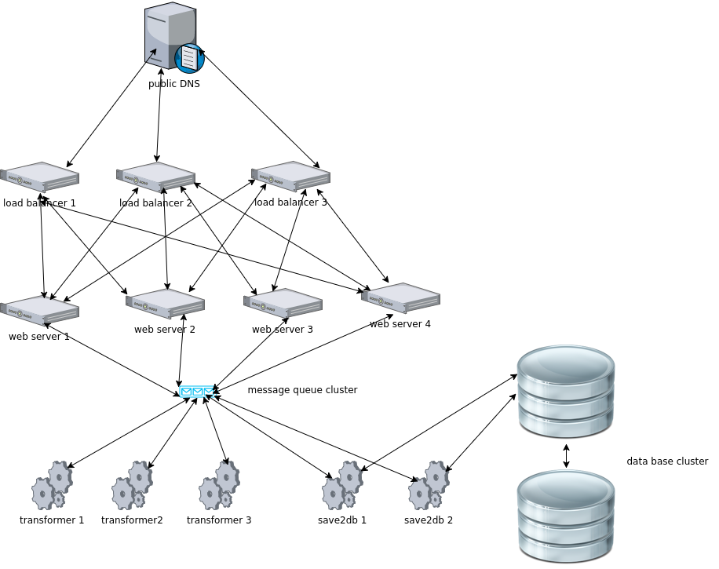
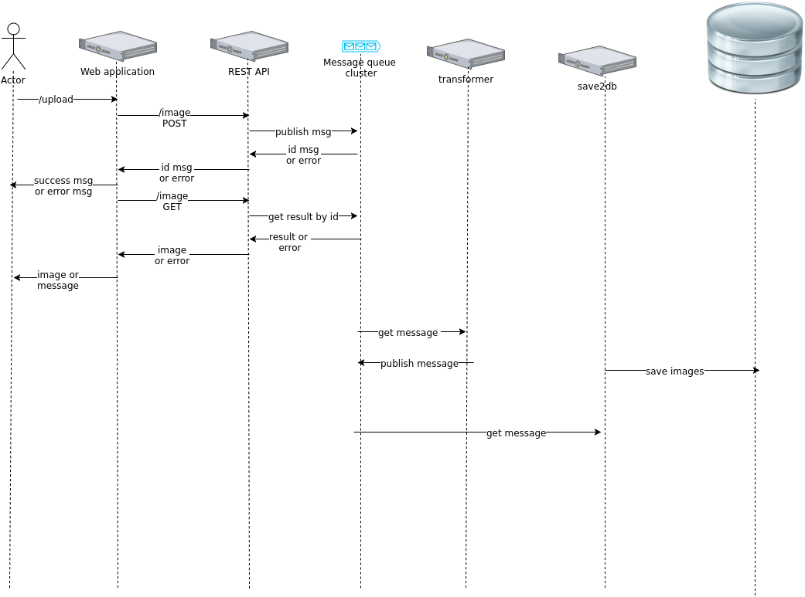

## Introduction
This project is a prototype presenting a model for uploading and transformation huge numbers of files using a Publish/Subscriber approach.

## How to install:
1. install and run RabbitMQ server: 
``` bash
docker run -d -p 5672:5672 --name rabbit1 rabbitmq
```

2. clone the repository: 
``` bash 
git clone https://github.com/ovidiumiron/prototype-web-app.git
```

3. create virtual env: 
``` bash
cd prototype-web-app/
virtualenv venv
```

4. activate virtual env: 
``` bash
source venv/bin/activate
```

5. install packages: 
``` bash
pip install -r requirements.txt
```

6. start web application: 
``` bash
python app.py
```

7. start worker: 
``` bash
celery -A celery_tasks.celery worker  --loglevel=info
```

Note:
- to start again the container with RabbitMQ: docker start rabbit1
- the web application starts on the port configured in config.py(4555)


## General Architecture

see the block diagram


### Public DNS
The public DNS returns round-robin the IPs of the load balancer.

### Load balancer
Distributes application traffic across the web servers. Each load balancer has implemented IP failover.
In case one machine goes down one of the others machines takes the IP.

### Web server
Exposes the web UI and the REST API.
In production, we can go with two types of web servers: one for UI interface and the other for REST API.

The REST API web server provides one endpoint 'image' which implement two methods:
- POST: push the image into the system publishing the message with a specific routing queue.
- GET: get the transformed image from the system.

The UI web server provides the user interface.

### Transformer
Transforms the image. Subscriber to the queue with the images.
Publish back into the MQC two messages:
1. message with the transformed image. This message is for the RAWS
2. message with the original image, transformed image and other specific information.
This message should be consumed by the save2db information.

### save2db
Saves the original image, transformed image and other information in database cluster.

### Message queue cluster
Provides the support for transporting the messages between components: REST API web server, transformer, save2db
Should have multiples routing rules for sending messages in different queues: like the queue for the REST API web server to get the result, the queue for save2db, the queue for logger( should be an application which keeps the messages activity from the system)

The message queue cluster can be RabbitMQ, Redis, etc.

### Database cluster
Save the images(original, transformed) and additional information for eternity.

### Software components
see sequence diagram:




### Scalability and redundancy
The system can scale up and down by adding or removing web servers, load balancers, message queue servers or database servers.
